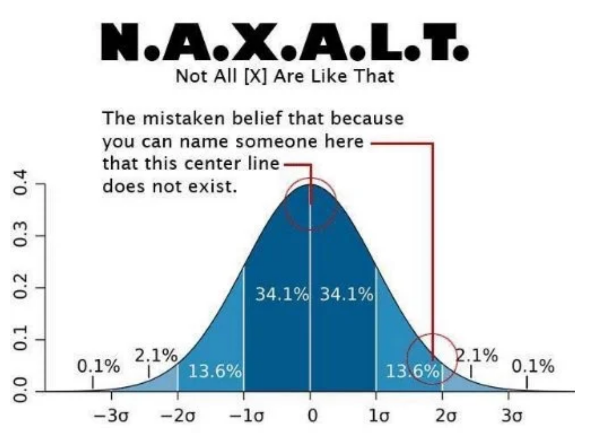

# Logical Fallacies

A logical fallacy is a flaw in reasoning. Logical fallacies are like tricks or illusions of thought, and they're often very sneakily used by politicians and the media to fool people.

A Formal Fallacy is a breakdown in how you say something. The ideas are somehow sequenced incorrectly. Their form is wrong, rendering the argument as noise and nonsense.

An Informal Fallacy denotes an error in what you are saying, that is, the content of your argument. The ideas might be arranged correctly, but something you said isn’t quite right. The content is wrong or off-kilter.

## Ad Hominem Fallacy

When people think of “arguments,” often their first thought is of shouting matches riddled with personal attacks. Ironically, personal attacks run contrary to rational arguments. In logic and rhetoric, a personal attack is called an ad hominem. Ad hominem is Latin for “against the man.” Instead of advancing good sound reasoning, an ad hominem replaces logical argumentation with attack-language unrelated to the truth of the matter.

More specifically, the ad hominem is a fallacy of relevance where someone rejects or criticizes another person’s view on the basis of personal characteristics, background, physical appearance, or other features irrelevant to the argument at issue.

An ad hominem is more than just an insult. It’s an insult used as if it were an argument or evidence in support of a conclusion. Verbally attacking people proves nothing about the truth or falsity of their claims. Use of an ad hominem is commonly known in politics as “mudslinging.” Instead of addressing the candidate’s stance on the issues, or addressing his or her effectiveness as a statesman or stateswoman, an ad hominem focuses on personality issues, speech patterns, wardrobe, style, and other things that affect popularity but have no bearing on their competence. In this way, an ad hominem can be unethical, seeking to manipulate voters by appealing to irrelevant foibles and name-calling instead of addressing core issues. In this last election cycle, personal attacks were volleyed freely from all sides of the political aisle, with both Clinton and Trump facing their fair share of ad hominem fallacies.
Ad hominem is an insult used as if it were an argument or evidence in support of a conclusion.

The use of ad hominem often signals the point at which a civil disagreement has descended into a “fight.” Whether it’s siblings, friends, or lovers, most everyone has had a verbal disagreement crumble into a disjointed shouting match of angry insults and accusations aimed at discrediting the other person. When these insults crowd out a substantial argument, they become ad hominems.

> Example: “MacDougal roots for a British football team. Clearly he’s unfit to be a police chief in Ireland.”

## Strawman Argument

It’s much easier to defeat your opponent’s argument when it’s made of straw. The Strawman argument is aptly named after a harmless, lifeless, scarecrow. In the strawman argument, someone attacks a position the opponent doesn’t really hold. Instead of contending with the actual argument, he or she attacks the equivalent of a lifeless bundle of straw, an easily defeated effigy, which the opponent never intended upon defending anyway.

The strawman argument is a cheap and easy way to make one’s position look stronger than it is. Using this fallacy, opposing views are characterized as “non-starters,” lifeless, truthless, and wholly unreliable. By comparison, one’s own position will look better for it. You can imagine how strawman arguments and ad hominem fallacies can occur together, demonizing opponents and discrediting their views.
With the strawman argument, someone attacks a position the opponent doesn’t really hold.

This fallacy can be unethical if it’s done on purpose, deliberately mischaracterizing the opponent’s position for the sake of deceiving others. But often the strawman argument is accidental, because the offender doesn’t realize the are oversimplifying a nuanced position, or misrepresenting a narrow, cautious claim as if it were broad and foolhardy.

> Example: “The Senator thinks we can solve all our ecological problems by driving a Prius.”

## Appeal to Ignorance (argumentum ad ignorantiam)

Any time ignorance is used as a major premise in support of an argument, it’s liable to be a fallacious appeal to ignorance. Naturally, we are all ignorant of many things, but it is cheap and manipulative to allow this unfortunate aspect of the human condition to do most of our heavy lifting in an argument.
An appeal to ignorance isn’t proof of anything except that you don’t know something.

Interestingly, appeal to ignorance is often used to bolster multiple contradictory conclusions at once. Consider the following two claims:

> “No one has ever been able to prove definitively that extra-terrestrials exist, so they must not be real.”

> “No one has ever been able to prove definitively that extra-terrestrials do not exist, so they must be real.”

If the same argument strategy can support mutually exclusive claims, then it’s not a good argument strategy.

An appeal to ignorance isn’t proof of anything except that you don’t know something. If no one has proven the non-existence of ghosts or flying saucers, that’s hardly proof that those things either exist or don’t exist. If we don’t know whether they exist, then we don’t know that they do exist or that they don’t exist. Appeal to ignorance doesn’t prove any claim to knowledge.

> Example: “We have no evidence that the Illuminati ever existed. They must have been so clever they destroyed all the evidence.”

## False Dilemma/False Dichotomy

This fallacy has a few other names: “black-and-white fallacy,” “either-or fallacy,” “false dichotomy,” and “bifurcation fallacy.” This line of reasoning fails by limiting the options to two when there are in fact more options to choose from. Sometimes the choices are between one thing, the other thing, or both things together (they don’t exclude each other). Sometimes there is a whole range of options, three, four, five, or a hundred and forty-five. However it may happen, the false dichotomy fallacy errs by oversimplifying the range of options.

Dilemma-based arguments are only fallacious when, in fact, there are more than the stated options. It’s not a fallacy however if there really are only two options. For example, “either Led Zeppelin is the greatest band of all time, or they are not.” That’s a true dilemma, since there really are only two options there: A or non-A. It would be fallacious however to say, “There are only two kinds of people in the world: people who love Led Zeppelin, and people who hate music.” Some people are indifferent about that music. Some sort of like it, or sort of dislike it, but don’t have strong feelings either way.

> Dilemma-based arguments are only fallacious when, in fact, there are more than the stated options.

The false dilemma fallacy is often a manipulative tool designed to polarize the audience, heroicizing one side and demonizing the other. It’s common in political discourse as a way of strong-arming the public into supporting controversial legislation or policies.

> Example: "Either we go to war, or we appear weak."

> Example: “Either you love me, or you hate me.”

## Appeal to worst problems

Dismissing a valid argument by comparing it to an even worse problem.

A: The food is terrible
B: Millions of children in Africa are starving. 

It is also used for dismissing action. 

Headlines: "Government to waive off the Farmer loans"
A: What about the education debt? Why not waive that?

### Avoid Appealing to worst problem

Stick to the current issue. 

## Causal Fallacy

The causal fallacy is any logical breakdown when identifying a cause. You can think of the causal fallacy as a parent category for several different fallacies about unproven causes.

One causal fallacy is the false cause or non causa pro causa ("not the-cause for a cause") fallacy, which is when you conclude about a cause without enough evidence to do so. Consider, for example, “Since your parents named you ‘Harvest,’ they must be farmers.” It’s possible that the parents are farmers, but that name alone is not enough evidence to draw that conclusion. That name doesn’t tell us much of anything about the parents. This claim commits the false cause fallacy.

Another causal fallacy is the post hoc fallacy. Post hoc is short for post hoc ergo propter hoc ("after this, therefore because of this"). This fallacy happens when you mistake something for the cause just because it came first. The key words here are “post” and “propter” meaning “after” and “because of.” Just because this came before that doesn’t mean this caused that. Post doesn’t prove propter. A lot of superstitions are susceptible to this fallacy. For example:

“Yesterday, I walked under a ladder with an open umbrella indoors while spilling salt in front of a black cat. And I forgot to knock on wood with my lucky dice. That must be why I’m having such a bad day today. It’s bad luck.”

Now, it’s theoretically possible that those things cause bad luck. But since those superstitions have no known or demonstrated causal power, and “luck” isn’t exactly the most scientifically reliable category, it’s more reasonable to assume that those events, by themselves, didn’t cause bad luck. Perhaps that person’s "bad luck" is just their own interpretation because they were expecting to have bad luck. They might be having a genuinely bad day, but we cannot assume some non-natural relation between those events caused today to go bad. That’s a Post Hoc fallacy. Now, if you fell off a ladder onto an angry black cat and got tangled in an umbrella, that will guarantee you one bad day.

Another kind of causal fallacy is the correlational fallacy also known as cum hoc ergo propter hoc (Lat., “with this therefore because of this"). This fallacy happens when you mistakenly interpret two things found together as being causally related. Two things may correlate without a causal relation, or they may have some third factor causing both of them to occur. Or perhaps both things just, coincidentally, happened together. Correlation doesn’t prove causation.

Consider for example, “Every time Joe goes swimming he is wearing his Speedos. Something about wearing that Speedo must make him want to go swimming.” That statement is a correlational fallacy. Sure it’s theoretically possible that he spontaneously sports his euro-style swim trunks, with no thought of where that may lead, and surprisingly he’s now motivated to dive and swim in cold, wet nature. That’s possible. But it makes more sense that he put on his trunks because he already planned to go swimming.

## Fallacy of Sunk Costs

Sometimes we invest ourselves so thoroughly in a project that we’re reluctant to ever abandon it, even when it turns out to be fruitless and futile. It’s natural and usually not a fallacy to want to carry on with something we find important, not least because of all the resources we’ve put into it. However, this kind of thinking becomes a fallacy when we start to think that we should continue with a task or project because of all that we’ve put into it, without considering the future costs we’re likely to incur by doing so. There may be a sense of accomplishment when finishing, and the project might have other values, but it’s not enough to justify the cost invested in it.

> We are susceptible to this errant behavior when we crave that sense of completion or a sense of accomplishment

“Sunk cost” is an economic term for any past expenses that can no longer be recovered. For example, after watching the first six episodes of Battlestar Galactica, you decide the show isn’t for you. Those six episodes are your “sunk cost.” But, because you’ve already invested roughly six hours of your life in it, you rationalize that you might as well finish it. All apologies to Edward James Olmos, but this isn’t "good economics" so to speak. It’s more cost than benefit.

Psychologically, we are susceptible to this errant behavior when we crave that sense of completion or a sense of accomplishment, or we are too comfortable or too familiar with this unwieldy project. Sometimes, we become too emotionally committed to an “investment,” burning money, wasting time, and mismanaging resources to do it.

> Example: “I know this relationship isn’t working anymore and that we’re both miserable. No marriage. No kids. No steady job. But I’ve been with him for seven years, so I’d better stay with him.”

## NAXALT fallacy (not all X are like that)

Exceptions and outliers don't mean something is not generally true. 

Example 1: 

A: Singapore is pretty clean

B: Have you been to Little India, it has a lot of litter. 

Example 2:

A: An Uber Driver doesn't make a lot after paying the commission and overhead costs.

B: I know a guy who made 10k dollars in a month driving for Uber.

### Avoid NAXALT

When ever you can think of X, quantify the probability of X. 

## Appeal to hypocrisy

When someone tries to divert attention away from one subject, by pointing the finger at someone or something else.

A: School shooting cause a lot of death. We should ban guns.

B: But in London there are knife attacks. So why ban guns. 

The argument "A" is making is not how to stop violence. The argument that he is making is that guns should be banned as they lead to school shooting. Whether or not knives can be used to kill people is not related to this.

### Avoid appealing to hypocrisy

Stick to the issue at hand. 

## Slippery Slope Fallacy

You may have used this fallacy on your parents as a teenager: “But, you have to let me go to the party! If I don’t go to the party, I’ll be a loser with no friends. Next thing you know I’ll end up alone and jobless living in your basement when I’m 30!” The slippery slope fallacy works by moving from a seemingly benign premise or starting point and working through a number of small steps to an improbable extreme.

This fallacy is not just a long series of causes. Some causal chains are perfectly reasonable. There could be a complicated series of causes that are all related, and we have good reason for expecting the first cause to generate the last outcome. The slippery slope fallacy, however, suggests that unlikely or ridiculous outcomes are likely when there is just not enough evidence to think so.
The slippery slope fallacy suggests that unlikely or ridiculous outcomes are likely when there’s just not enough evidence to think so.

It’s hard enough to prove one thing is happening or has happened; it’s even harder to prove a whole series of events will happen. That’s a claim about the future, and we haven’t arrived there yet. We, generally, don’t know the future with that kind of certainty. The slippery slope fallacy slides right over that difficulty by assuming that chain of future events without really proving their likelihood.

> Example: “If America doesn’t send weapons to the Syrian rebels, they won’t be able to defend themselves against their warring dictator. They’ll lose their civil war, and that dictator will oppress them, and the Soviets will consequently carve out a sphere of influence that spreads across the entire Middle East.”

## Circular Argument (petitio principii)

When a person’s argument is just repeating what they already assumed beforehand, it’s not arriving at any new conclusion. We call this a circular argument or circular reasoning. If someone says, “The Bible is true; it says so in the Bible”—that’s a circular argument. They are assuming that the Bible only speaks truth, and so they trust it to truthfully report that it speaks the truth, because it says that it does. It is a claim using its own conclusion as its premise, and vice versa, in the form of “If A is true because B is true; B is true because A is true”. Another example of circular reasoning is, “According to my brain, my brain is reliable.” Well, yes, of course we would think our brains are in fact reliable if our brains are the one’s telling us that our brains are reliable.

Circular arguments are also called Petitio principii, meaning “Assuming the initial [thing]” (commonly mistranslated as “begging the question”). This fallacy is a kind of presumptuous argument where it only appears to be an argument. It’s really just restating one’s assumptions in a way that looks like an argument. You can recognize a circular argument when the conclusion also appears as one of the premises in the argument.

Another way to explain circular arguments is that they start where they finish, and finish where they started. See if you can identify which of these is a circular argument.

> Example: “Smoking pot is against the law because it’s wrong; I know it’s wrong because it is against the law.”

## Hasty Generalization

A hasty generalization is a general statement without sufficient evidence to support it. A hasty generalization is made out of a rush to have a conclusion, leading the arguer to commit some sort of illicit assumption, stereotyping, unwarranted conclusion, overstatement, or exaggeration.

Normally we generalize without any problem; it is a necessary, regular part of language. We make general statements all the time: “I like going to the park,” "Democrats disagree with Republicans,” "It’s faster to drive to work than to walk," or "Everyone mourned the loss of Harambe, the Gorilla.”

Hasty generalization may be the most common logical fallacy because there’s no single agreed-upon measure for “sufficient” evidence.

Indeed, the above phrase “all the time” is a generalization — we aren’t literally making these statements all the time. We take breaks to do other things like eat, sleep, and inhale. These general statements aren’t addressing every case every time. They are speaking generally, and, generally speaking, they are true. Sometimes you don’t enjoy going to the park. Sometimes Democrats and Republicans agree. Sometimes driving to work can be slower than walking if the roads are all shut down for a Harambe procession.

Hasty generalization may be the most common logical fallacy because there’s no single agreed-upon measure for “sufficient” evidence. Is one example enough to prove the claim that, "Apple computers are the most expensive computer brand?" What about 12 examples? What about if 37 out of 50 apple computers were more expensive than comparable models from other brands?

There’s no set rule for what constitutes “enough” evidence. In this case, it might be possible to find reasonable comparison and prove that claim is true or false. But in other cases, there’s no clear way to support the claim without resorting to guesswork. The means of measuring evidence can change according to the kind of claim you are making, whether it’s in philosophy, or in the sciences, or in a political debate, or in discussing house rules for using the kitchen. A much safer claim is that "Apple computers are more expensive than many other computer brands.”

Meanwhile, we do well to avoid treating general statements like they are anything more than simple, standard generalizations, instead of true across the board. Even if it is true that many Apple computers are more expensive than other computers, there are plenty of cases in which Apple computers are more affordable than other computers. This is implied in the above generalization, but glossed over in the first hasty generalization.

A simple way to avoid hasty generalizations is to add qualifiers like “sometimes,” "maybe," "often," or "it seems to be the case that . . . ". When we don’t guard against hasty generalization, we risk stereotyping, sexism, racism, or simple incorrectness. But with the right qualifiers, we can often make a hasty generalization into a responsible and credible claim.

> Example: “People nowadays only vote with their emotions instead of their brains.”

## Red Herring Fallacy (ignoratio elenchi)

A “red herring fallacy” is a distraction from the argument typically with some sentiment that seems to be relevant but isn’t really on-topic. This tactic is common when someone doesn’t like the current topic and wants to detour into something else instead, something easier or safer to address. A red herring fallacy is typically related to the issue in question but isn’t quite relevant enough to be helpful. Instead of clarifying and focusing, it confuses and distracts.
A red herring fallacy can be difficult to identify because it’s not always clear how different topics relate.

The phrase “red herring” refers to a kippered herring (salted herring-fish) which was reddish brown in color and quite pungent. According to legend, this aroma was so strong and delectable to dogs that it served as a good training device for testing how well a hunting dog could track a scent without getting distracted. Dogs aren’t generally used for hunting fish so a red herring is a distraction from what he is supposed to be hunting.

A red herring fallacy can be difficult to identify because it’s not always clear how different topics relate. A “side” topic may be used in a relevant way, or in an irrelevant way. In the big meaty disagreements of our day, there are usually a lot of layers involved, with different subtopics weaving into them. We can guard against the red herring fallacy by clarifying how our part of the conversation is relevant to the core topic.

> Example: “My wife wants to talk about cleaning out the garage, so I asked her what she wants to do with our patio furniture. Now she’s shopping for new patio furniture and not asking me about the garage.”

## Kafka trap

Accusing someone of being a racist or a sexist etc. and then claiming that any attempt to argue, deny or defend themselves is proof of guilt e.g.“Your refusal to acknowledge that you are guilty of racism, confirms that you are guilty of racism”

## Poisoning the well 

Planting seeds of doubt in the listeners mind by implying that someone can’t be trusted before they’ve even opened their mouth e.g. “The fact is that Bobby’s a liar and a conman – you can believe him if you want but I definitely wouldn’t – and if you do you’ll be sorry…” 

## Hollow man argument 

Attacking an argument no one holds and no one is making, destroying it, and then claiming victory

## Weak man argument 

Attacking only the weakest and worst parts of an opponent’s argument, and then treating it as the best or the only argument they have – or comparing only the best and strongest parts of your argument, with the weakest and worst parts of your opponents argument

## Nutpicking 

Cherry picking only the craziest, nuttiest, most extreme members of a group, as if they were an accurate representation of the group as a whole

## Non Sequitur 

A conclusion or statement that doesn’t logically follow from the previous statement (not necessarily intellectual dishonest but can be)

## Motte-and-bailey 

The arguer conflates two similar positions, one modest and easy to defend (the “motte”) and one controversial (the “bailey”). The arguer advances the controversial position, but when challenged, they insist that they are only advancing the more modest position

## PRATT’s (Point Refuted a Thousand Times) 

Deliberately making arguments that have been refuted ad nauseam to persuade the uneducated and uninformed

## Denial of commitment 

Making a claim, and then when it’s attacked or criticized, you try to avoid taking responsibility for it e.g. You: “Flat earthers are either stupid or trolling” Her: “Kyrie thinks the Earth is flat, he says there’s lots of evidence for it, and he seems pretty smart” You: “What evidence is there for a flat earth? What about the mountains of evidence that proves the earth is round/spheroid?” Her: “I’m just telling you what Kyrie said”.  This is disingenuous. If someone quotes someone to make a point in an argument, or shares a quote or meme, it’s clear that they agree with it on some level. In an argument take responsibility for your words and actions, what you say and what you share, instead of pointing the finger at other people

## Definist fallacy 

Insisting on defining a word in a way that is favorable to one’s own side of an argument. e.g. “Abortion should be defined as murder”, “taxation should be defined as theft by the state”, “Black people can’t be racist! Racism is prejudice plus power!”

### Definitional retreat 
Attempting to change the meaning of a word or a phrase mid-argument to deal with a counterargument or an objection, in order to save face, and to prevent you from admitting you were wrong e.g. “When I said “poor” “rich” “sexual relations” etc. what I really meant was…”

### Equivocation 
Deliberately switching the meaning of a word with more than one meaning mid-argument, when it expresses one concept in one premise, and another concept in another premise or in the conclusion e.g “Evolution is just a theory”

### Doublespeak

Instead of speaking plainly so people can actually understand you, you use ambiguous language, or highly specialized or technical language e.g. “legalese” to confuse, deceive, mislead or intimidate the listener

## Muddying the waters 

Any attempt to confuse the issue or obfuscate by introducing irrelevant arguments and information, talking around the point without touching on it directly, or using a lot of big words or technical jargon unlikely to be understood by the listener in order to confuse and deceive them

## Negative pregnant statements 

In response to the question: “Do you owe this person money?” You might reply: “I don’t owe this person $1, 000” (implying that you might owe them $500, $1500 or some other amount. You’re changing the question so that you can avoid the question being asked, and answer in such a way that it makes you seem less guilty)

## False Premises

Deliberately misquoting your opponent or taking a quote out of context in order to give a misleading impression e.g. quoting someone who was joking or being sarcastic and portraying their quote as if they were being sincere, or quoting someone on something incorrect they’ve said in the past, after they’ve already acknowledged the mistake and changed their mind, as if they still held that view

Making statements on behalf of false premises as if:

> Something was a scientific fact when it isn’t “Science has proven…”

> Something had unanimous backing from the scientific community when it doesn’t

> Something was unanimously accepted and believed by everyone when it isn’t “Everyone knows that!”

### Weasel words 

When someone tries to introduce anonymous authorities into a conversation in order to make their arguments or claims sound more persuasive and valid than they really are e.g. “Studies show…” “Statistics show…” “Scientists say…” 

## Attempting to silence 
* Accusing them of engaging in “hate speech”, “mansplaining” or “whitesplaining”
* Acting aggressive, erratic, hostile, or unpredictable
* Giving dirty, evil, shitty looks and death stares in order to intimidate
* Interrupting, talking over them, swearing, threatening, yelling
* By labeling them: Fascist, Homophobe, Islamophobe, Transphobe, Misogynist, Nazi

### Traitorous critic fallacy
Attacking someone when they make a valid complaint to shut them up e.g. “Why is there so much crime, corruption and violence in this country?” You: “If you don’t like it, why don’t you go back to your own country!”

### Emotional manipulation: 

Instead of trying to persuade someone with logic, facts and evidence, you try to emotionally manipulate them by crying, playing the victim, or if you’re an advertiser showing them videos of cute puppies, starving children etc.

### Fake facial expressions designed to mock and ridicule your opponent (a common debating tactic of politicians) or to give the misleading impression that you know something you don’t, instead of actually addressing the points in their argument:
        Eye rolling
        Raised eyebrows
        Shaking your head
        Sighing
        Snickering

## False analogies 
You deliberately make false analogies to make your point

## False authorities: 

You deliberately quote a false authority not qualified as an expert on the topic in order to persuade the uninformed e.g. Bill Nye on quantum physics
   
 